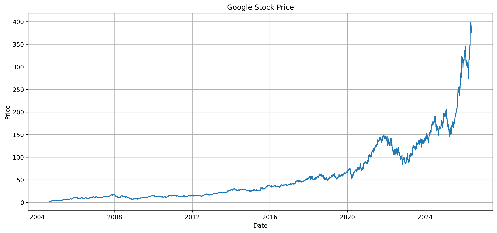
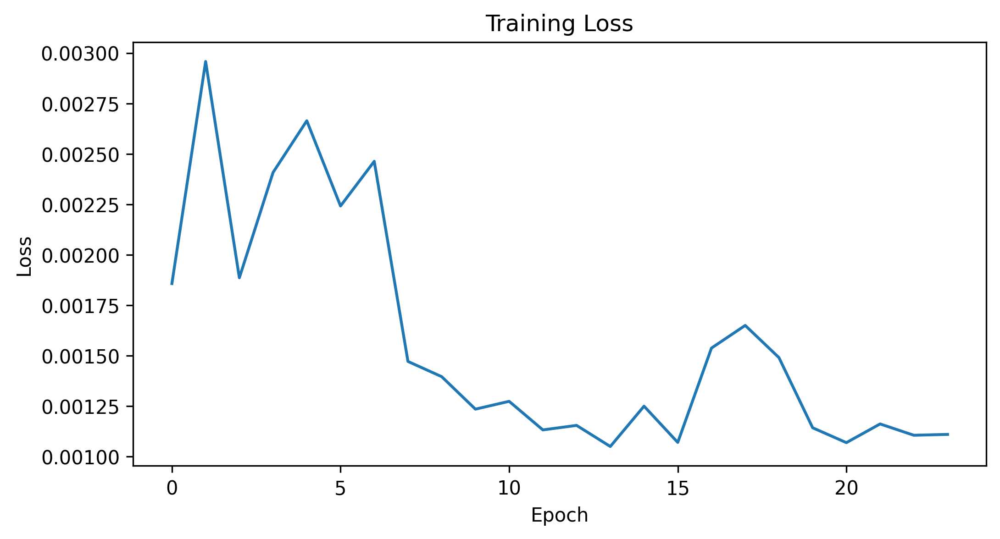
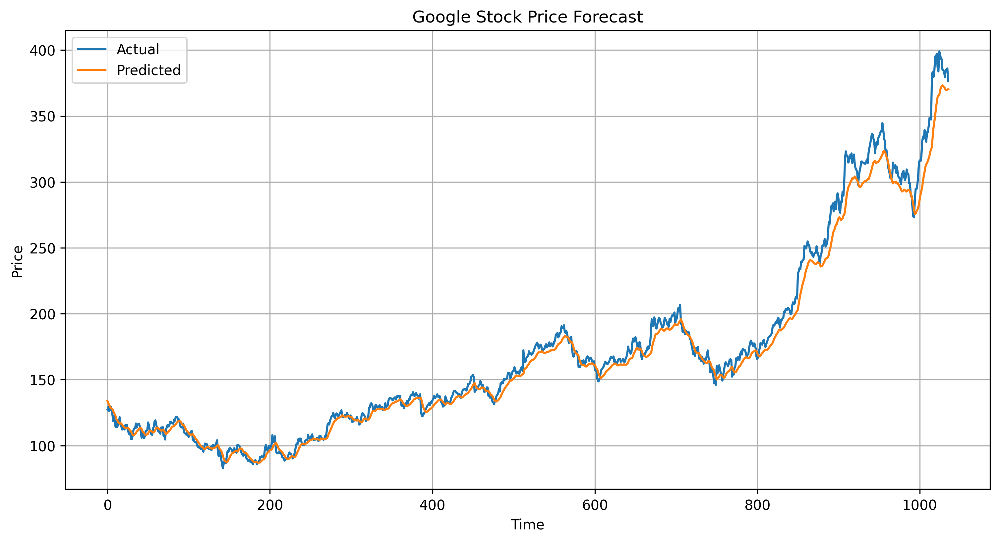

# Google Stock Price Forecasting Using LSTM Networks


---

## Overview

This project applies Long Short-Term Memory (LSTM) neural networks to forecast Google (GOOG) stock prices using historical market data obtained from Yahoo Finance.

The objective is to evaluate the ability of deep learning models to capture temporal dependencies in financial time series and generate one-step-ahead forecasts.

The project follows a complete machine learning workflow consisting of data acquisition, preprocessing, sequence generation, neural network training, forecasting, and model evaluation.

---

## Historical Stock Price



*Figure 1: Historical evolution of Google stock prices.*

---

## Dataset

| Feature | Description |
|----------|-------------|
| Asset | Google (GOOG) |
| Source | Yahoo Finance |
| Frequency | Daily |
| Variable | Adjusted Closing Price |
| Period | August 2004 – Present |

> Google became publicly traded in August 2004. Historical stock prices before this date are unavailable.

---

## Project Workflow

```text
Historical Stock Prices
          │
          ▼
 Data Preprocessing
          │
          ▼
 Feature Scaling
          │
          ▼
 Sequence Generation
          │
          ▼
 LSTM Neural Network
          │
          ▼
 Stock Price Forecasting
          │
          ▼
 Performance Evaluation
```

---

## Data Preparation

The following preprocessing procedures were implemented:

- Download historical stock prices using Yahoo Finance
- Extract adjusted closing prices
- Chronological train-test split
- Min-Max normalization
- Sequence generation using rolling windows

---

## Sequence Construction

A lookback window of **60 trading days** was used.

```text
Day 1
Day 2
Day 3
...
Day 60  ───► Predict Day 61
```

This converts the time series into a supervised learning problem suitable for recurrent neural networks.

---

## Model Architecture

The forecasting model consists of:

```python
model = tf.keras.Sequential([
    tf.keras.layers.Input(shape=(60,1)),
    tf.keras.layers.LSTM(32, activation='relu'),
    tf.keras.layers.Dropout(0.2),
    tf.keras.layers.Dense(1)
])
```

### Training Configuration

| Parameter | Value |
|------------|---------|
| Optimizer | Adam |
| Loss Function | Mean Squared Error |
| Epochs | 100 |
| Batch Size | 32 |
| Early Stopping | Enabled |

---

## Training Performance



*Figure 2: Training loss during neural network optimization.*

---

## Forecasting Results



*Figure 3: Comparison between actual and predicted Google stock prices.*

---

## Performance Metrics

Model performance was evaluated using:

- Root Mean Squared Error (RMSE)
- Coefficient of Determination (R²)

Example output:

```text
RMSE = 9.3724

R² = 0.9831
```

---

## Repository Structure

```text
google-stock-price-forecasting-lstm/
│
├── GOOGLE_LSTM_Project.ipynb
├── README.md
├── requirements.txt
│
├── images/
│   ├── google_stock_price.png
│   ├── training_loss.png
│   └── forecast_results.png
│
└── saved_models/
    └── google_lstm_model.keras
```

---

## Installation

Clone the repository:

```bash
git clone https://github.com/elijah-appiah/deep-learning-LSTM-GOOGLE-stock-forecasting.git
```

Navigate to the project directory:

```bash
cd deep-learning-LSTM-GOOGLE-stock-forecasting
```

Install the required packages:

```bash
pip install -r requirements.txt
```

---

## Running the Notebook

Launch Jupyter Notebook:

```bash
jupyter notebook
```

Alternatively, open the notebook directly in Google Colab.

Run all notebook cells sequentially to reproduce the results.

---

## Technologies Used

- Python
- TensorFlow / Keras
- NumPy
- Pandas
- Scikit-Learn
- Matplotlib
- Yahoo Finance (yfinance)

---

## Future Improvements

Potential extensions include:

- Stacked LSTM architectures
- Bidirectional LSTM models
- GRU networks
- Attention mechanisms
- Transformer-based forecasting
- Hyperparameter optimization
- Multi-step forecasting
- Technical indicator integration
- Sentiment-enhanced forecasting

---

## Disclaimer

This project is intended solely for educational and research purposes.

The forecasts generated by the model should not be interpreted as financial advice, investment recommendations, or trading signals.

---

## Author

**Elijah Appiah**

PhD Candidate in Economics  
National Institute of Development Administration (NIDA), Thailand

### Research Interests

- Financial Econometrics
- Quantitative Finance
- Machine Learning
- Deep Learning for Financial Markets
- Time Series Forecasting

---

## License

This project is released under the MIT License.
